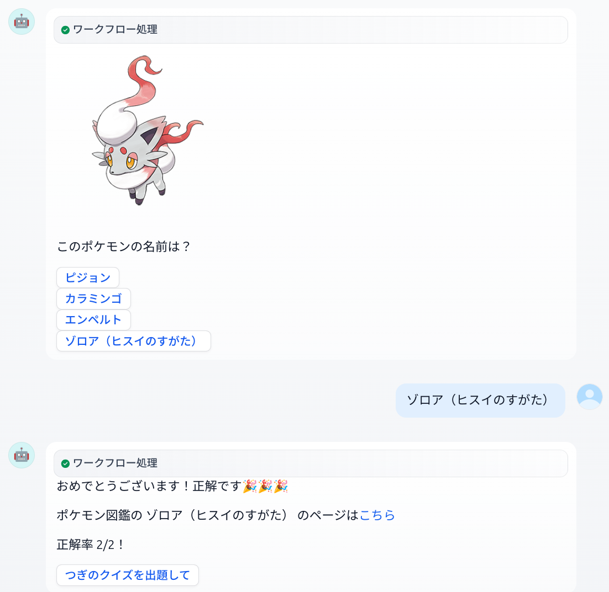
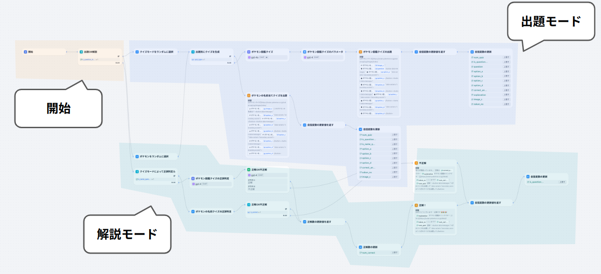
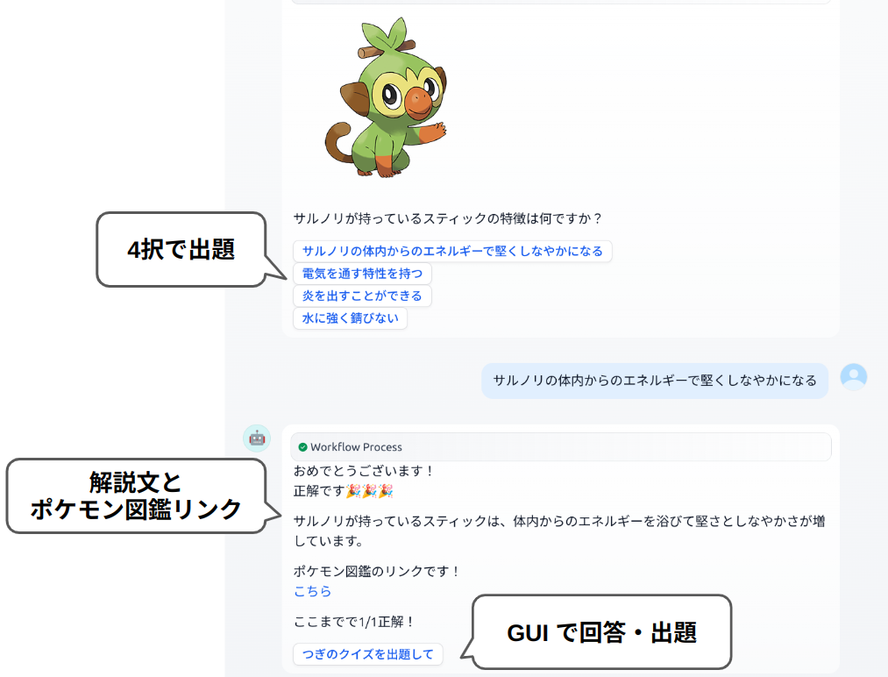

# ポケモンクイズアプリ
## 概要
- ポケモンクイズのアプリ
- ポケモンの名前・特徴を当てるクイズ

## 特徴
- チャット形式でクイズを出題され、ユーザーはクイズに答えます。

## 利用シーン
- ポケモンの名前を覚えたい
- ポケモンの特徴を覚えたい

## 使い方
チャットに従い回答するだけ。

## 導入
- Dify を使ったアプリになっています。
- Dify はプログラミングの知識がなくても簡単にアプリ開発ができるノーコード自動化 AI ツールです。

### 構成

### 前提
下記のサービスを利用します。

- Dify
    - プログラミングの知識がなくても簡単にアプリ開発ができるノーコード自動化 AI ツールです。
    - 有料プランがあります。
    - [公式ページ](https://dify.ai/pricing)
- OpenAI API
    - OpenAI が提供するモデルを利用できます。
    - 有料プランがあります。
    - [公式ページ](https://openai.com/api/pricing/)

### デプロイ
ここでは Dify の公式ページからデプロイする方法を紹介します。

1. アカウント作成
    - 公式ページ にアクセスして、 「始める」ボタンからアカウントを作成します。
2. ワークフローの作成
    - ホーム画面が開き「アプリを作成する」の欄に表示されている「DSL ファイルをインポート」を選択します。
    - このリポジトリの pokemon_quiz_app.yaml を指定する。

## ポケモンクイズの例
実際に操作したときのやりとり。

